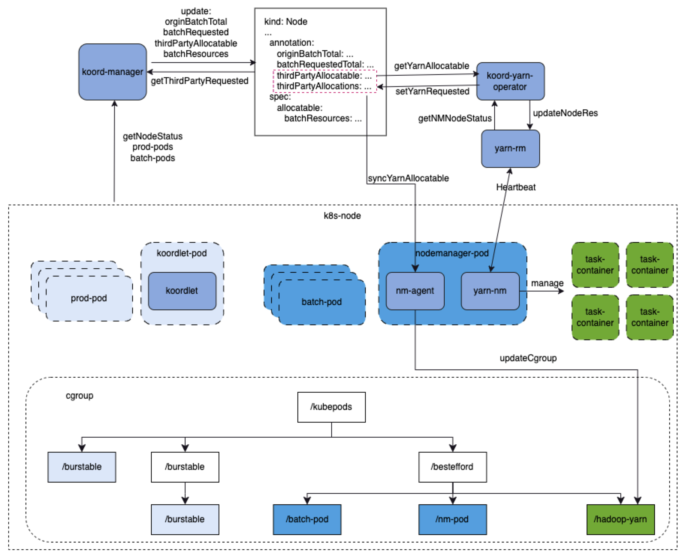
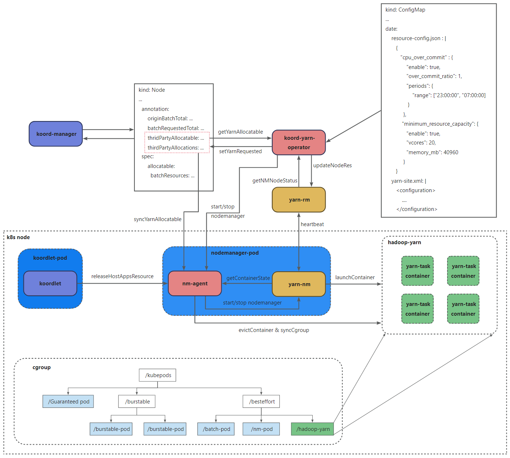

## **背景**

为了能够更有效地利用闲置与碎片的batch资源，需要考虑将不同类型的离线任务容器与yarn任务同时进行混部，共享batch资源。
官方yarn on koord的[混部方案](https://koordinator.sh/zh-Hans/docs/designs/koordinator-yarn)，yarn operator组件用于监听k8s node的batch资源变化并同步到Yarn RM侧。
该方案仅适用于在混部场景yarn独占节点batch资源的场景，为了实现其他使用batch资源的离线容器与YARN共享batch资源，需要koordinator与YARN之间需要做batch资源同步优化。

## **koordinator侧优化**



### **batch资源计算同步**

在Koordinator中，节点超卖的Batch资源量由koord-manager根据节点资源负载情况动态计算得出，并以extended-resource形式更新在K8s的Node对象中。
在训练容器和yarn共享batch资源的情况下，将由koord-manager负责根据batch总量和训练batch容器申请量来计算出可以给yarn的batch资源量，然后由koord-yarn-operator组件负责将节点的Batch资源量同步给YARN RM。
为了能够灵活控制YARN的batch资源量，koordinator方面将增加新的配置项thirdPartyResourceConfig

```json
slo-colocation-config：|
{  
   ...
   "thirdPartyResourceConfig": [
     {
       "thirdPartyName": "hadoop-yarn",
       "batchResourceRatio": {
         "batchCpu": 80,
         "batchMemory": 80
       },
       "cgroupPath": "/hadoop-yarn"
     }
   }
   ...
}
```

由于koordinator调度器和YARN调度器共享Batch账本，因此 在资源同步时需要将另一个系统中已经分配的Batch资源排除。
具体过程如下：

1. koord-manager根据节点资源总量和实际负载，按sol-colocation配置计算原始Batch总量，并将其记录在K8s的node annotation中的originalBatchTotal
2. koord-manager计算节点已分配的batch资源，记录在k8s的node annotation中的batchRequestedTotal
3. koord-manager根据originalBatach，扣除batchRequestedTotal，再按照新增配置thirdPartyResourceConfig，算出可以给到yarn的thirdPartyAllcatable资源，保存到k8s node annotation中
4. koord-yarn-operator根据k8s node annotation中thirdPartyAllocatable资源中的yarnAllocatable，同步给YARN-ResourceManager来设置YARN-NodeManager的资源。
5. koord-yarn-operator从YARN RM收集YARN节点已经分配的资源量yarnRequested，并将其记录在K8s的node annotation的thirdPartyAllocation中。
6. 在koord-manager更新K8s的Batch可分配资源时，排除YARN已经分配的资源量：k8sBatchAllocatable = originBatchTotal – yarnRequested

thirdPartyAllocatable示例

```json
[
  {
    "thirdPartyName": "hadooop-yarn",
    "allocatableResources":{
      "kubernetes.io/batch-cpu":"70825",
      "kubernetes.io/batch-memory":"225125172441"
    }
  }
...
]
```

thirdPartyAllocation实例

```json
[
  {
    "thirdPartyName": "hadooop-yarn",
    "allocatatedResources":{
      "kubernetes.io/batch-cpu":"50347",
      "kubernetes.io/batch-memory":"114415252212"
    }
  }
...
]
```

### **调度仲裁**

当集群中训练任务较多时，可能会出现任务等待，这时需要制约YARN的资源调度，通过调度和实时管控两个层面控制

1. 当集群出现少量的训练任务等待时，缩减yarnAllocatable，避免新的yarn task调度占用更多的batch资源
2. 当集群出现较多的训练任务等待时，需要驱逐正在运行的yarn task，让出其占用的batch资源

## **Yarn模块优化**



### **yarn同步可用batch资源**

yarn可用的batch资源计算流程见koordinator优化

yarn batch资源同步过程:

1. koord-yarn-operator根据k8s node annotation中thirdPartyAllocatable资源中的yarnAllocatable，判断是否满足yarn最小资源规格。满足则调用nm-agent提供的接口启动NodeManager(NM未启动的情况下)并结合yarn operator的超卖时间区间及超卖比例，同步给YARN-ResourceManager来设置YARN-NodeManager的资源；反之，则调用nm-agent提供的接口下线nodemanager。
2. koord-yarn-operator从YARN RM收集YARN节点已经分配的资源量yarnRequested结合yarn operator的超卖区间及超卖比例，并将其记录在K8s的node annotation的thirdPartyAllocation中。

### **QOS管控规则**

结合Koordinator的现有架构，将yarn task作为宿主机应用，由Koordlet通过hostApp方式进行统一QOS管控。

```json
host-application-config: |
  {
    "nodeConfigs": [
      {
        "name": "colo-yarn",
        "nodeSelector": {
          "matchLabels": {
            "deploy-yarn-nm": "true"
          }
        },
        "applications": [
          {
            "name": "yarn-task",
            "priority": "koord-batch",
            "qos": "BE",
            "cgroupPath": {
              "base": "KubepodsBesteffort",
              "relativePath": "hadoop-yarn/"
            },
            "strategy": {
              "cpuQOS": {
                "enable": true,
                "groupIdentity": -1
              },
              "blkioQOS": {
                "enable": false
              }
            },
            "resourceEvict": {
              "enable": true,
              "resourceEvictType": [
                "cpu",
                "memory"
              ],
              "endpoint": "/host-run/yarn-copilot/yarn-copilot.sock",
              "operateAPI": "http://localhost/v1/killContainersByResource",
              "contentType": "application/json",
              "acceptContentType": "application/json"
            }
          }
        ]
      }
    ]
  }
```

1. hostApplication支持静态Qos规则，如host-application-config配置中的strategy节点。目前支持cpu/blkio静态Qos规则。

   | Configuration item     | Parameter | Valid values | Description                                        |
   | ---------------------- | --------- | ------------ | -------------------------------------------------- |
   | cpuQOS.enable          | bool      | true / false | 是否使用cpuQos规则                                 |
   | cpuQOS.groupIdentity   | int       | [-1,2]       | 该hostApp的cpu cgroup子系统中的cpu.bvt_warp_ns的值 |
   | blkioQOS.blocks.enable | bool      | true / false | 针对该块设备是否启动blkioQOS规则                   |
   | blkioQOS.blocks.name   | string    | N/A          | 块设备的名字                                       |
   | blkioQOS.blocks.ioCfg  | json      | N/A          | 该hostApp的blkio cgroup子系统中的值                |

2. hostApplication支持释放资源，如host-application-config配置中的resourceEvict节点

   | Configuration item | Parameter | Valid values    | Description                                    |
   | ------------------ | --------- | --------------- | ---------------------------------------------- |
   | enable             | bool      | true / false    | 该hostApp是否支持释放已使用的物理资源          |
   | resouceEvictType   | []string  | ["cpu","memory] | 该hostApp支持释放的物理资源类型，如cpu、memory |
   | endpoint           | string    | N/A             | koordlet与之通信的unix domain socket文件       |
   | operateAPI         | string    | N/A             | hostApp暴露的释放资源的接口                    |
   | contentType        | string    | N/A             | 请求内容类型,application/json                  |
   | acceptContentType  | string    | N/A             | 响应内容类型,application/json                  |

### **实时管控**

1. koordlet过热保护
   koordlet根据节点负载情况结合混部场景驱逐策略(CPU满足度驱逐/内存安全水位)对yarn-task进行驱逐。
   其中，yarn-task以hostApplications的方式部署并针对该hostApplications定义QOS规则及资源驱逐方式。
   koordlet与nm-agent通过unix domain socket方式进行交互，koordlet调用nm-agent提供的释放资源接口并传递需要释放的资源量，nm-agent根据yarn task的优先级、资源使用量、运行时长等因素进行排序驱逐。
2. batch资源缩减
   nm-agent监听节点thridPartyAllocatable资源变化结合yarn task的优先级、资源使用量、运行时长等因素 驱逐部分yarn task以压制yarn task资源使用量到thridPartyAllocatable以下，并且对/hadoop-yarn层级的cgroup进行资源限制。
3. 内存超卖控制
   增加oomgroup设置，内存不足时优先对hadoop-yarn下的容器进行OOMKill
